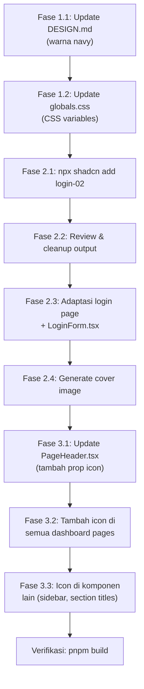

# Implementation Plan — Redesain Login, Perubahan Warna & Penambahan Icon

> [!NOTE]
> Plan ini dibuat berdasarkan analisis lengkap terhadap project Maxxsiren. Project sudah menggunakan **Shadcn UI** (terverifikasi dari `components.json`, komponen di `src/components/ui/`, dan dependensi Radix UI di `package.json`).

---

## Ringkasan Analisis Project

### Konfirmasi Stack
| Item | Status |
|---|---|
| Shadcn UI | **Ya** — `components.json` ada, 10 primitif di `src/components/ui/` |
| Tailwind CSS v4 | **Ya** — `@import "tailwindcss"` di `globals.css` |
| lucide-react | **Ya** — sudah terinstal, digunakan di Sidebar & dashboard |
| react-hook-form + Zod | **Ya** — digunakan di `LoginForm.tsx` saat ini |
| Supabase Auth | **Ya** — `loginAction` di `auth.actions.ts` |

### Kondisi Login Saat Ini
- Login page: `src/app/(auth)/login/page.tsx` — layout sederhana `min-h-screen flex items-center justify-center`
- Form component: `src/features/auth/components/LoginForm.tsx` — menggunakan Card + form sederhana
- Tidak ada branding visual, tidak ada gambar, tidak ada split-screen layout

### Kondisi Icon Saat Ini
- **Sidebar**: Sudah punya icon per menu item (lucide-react)
- **Dashboard KartuRingkasan**: Sudah punya icon (Package, Layers, AlertTriangle, Activity)
- **PageHeader**: **Tidak ada icon** — hanya teks title + subtitle
- **Page-level branding**: Tidak ada icon yang menandai konteks halaman

### Kondisi Warna Saat Ini
- **Primary**: Hijau teal `hsl(161 40% 39%)` — **bertabrakan** dengan semantic green (stok aman)
- **Sidebar**: Dark green `hsl(161 25% 16%)`
- **Semantic colors**: Sudah benar (green/yellow/red/blue) tapi primary hijau mengurangi kontras badge stok

---

## Fase 1 — Perubahan Palet Warna (Hijau → Navy Blue)

> [!IMPORTANT]
> Sesuai aturan AGENTS.md, perubahan UI/visual harus update `docs/DESIGN.md` terlebih dahulu, baru implementasi di code.

### 1.1 Update `docs/DESIGN.md`

**File:** `docs/DESIGN.md`

Bagian yang diperbarui:

#### Section 1.1 — Brand Colors

| Token | Sebelum (Hijau) | Sesudah (Navy) | Alasan |
|---|---|---|---|
| `--primary` | `hsl(161 40% 39%)` | `hsl(215 55% 28%)` | Navy blue profesional, tidak konflik dengan success green |
| `--primary-hover` | `hsl(161 40% 33%)` | `hsl(215 55% 23%)` | Darker navy untuk hover |
| `--primary-foreground` | `hsl(0 0% 100%)` | `hsl(0 0% 100%)` | Tetap putih |
| `--primary-subtle` | `hsl(161 40% 95%)` | `hsl(215 55% 96%)` | Light navy tint |
| `--secondary` | `hsl(120 10% 46%)` | `hsl(215 15% 46%)` | Slate gray (netral, cool-toned) |
| `--secondary-hover` | `hsl(120 10% 40%)` | `hsl(215 15% 40%)` | Darker slate |
| `--secondary-subtle` | `hsl(120 10% 95%)` | `hsl(215 15% 95%)` | Light slate |
| `--ring` | `hsl(161 40% 39%)` | `hsl(215 55% 28%)` | Mengikuti primary |

#### Section 1.2 — Semantic Colors (TIDAK BERUBAH)

| Token | HSL | Status |
|---|---|---|
| `--success` | `hsl(150 50% 35%)` | Tetap — stok aman, transaksi sukses |
| `--warning` | `hsl(35 78% 45%)` | Tetap — stok menipis, perlu restok |
| `--danger` | `hsl(5 64% 46%)` | Tetap — stok habis, error, kondisi kritis |
| `--info` | `hsl(217 91% 54%)` | Tetap — grafik, diagram, informasi umum |

#### Section 1.3 — Neutral Scale (TIDAK BERUBAH)

Background tetap putih/abu-abu netral — sudah sesuai dengan keinginan user.

#### Sidebar Colors

| Token | Sebelum (Hijau) | Sesudah (Navy) |
|---|---|---|
| `--sidebar-bg` | `hsl(161 25% 16%)` | `hsl(215 40% 14%)` |
| `--sidebar-text` | `hsl(161 10% 85%)` | `hsl(215 10% 85%)` |
| `--sidebar-muted` | `hsl(161 10% 60%)` | `hsl(215 10% 60%)` |
| `--sidebar-active` | `hsl(161 40% 39%)` | `hsl(215 55% 38%)` |
| `--sidebar-border` | `hsl(161 20% 22%)` | `hsl(215 30% 22%)` |

#### Shadow Focus

| Token | Sebelum | Sesudah |
|---|---|---|
| `--shadow-focus` | `0 0 0 3px hsl(161 40% 39% / 0.25)` | `0 0 0 3px hsl(215 55% 28% / 0.25)` |

### 1.2 Update `src/app/globals.css`

**File:** `src/app/globals.css`

Implementasi semua perubahan token warna dari DESIGN.md ke CSS variables di `:root` dan `@theme inline`.

**Perubahan spesifik:**
```css
/* SEBELUM */
--primary: hsl(161 40% 39%);
--primary-hover: hsl(161 40% 33%);
--primary-foreground: hsl(0 0% 100%);
--primary-subtle: hsl(161 40% 95%);
--secondary: hsl(120 10% 46%);
--secondary-hover: hsl(120 10% 40%);
--secondary-subtle: hsl(120 10% 95%);
--ring: hsl(161 40% 39%);
--sidebar-bg: hsl(161 25% 16%);
--sidebar-text: hsl(161 10% 85%);
--sidebar-muted: hsl(161 10% 60%);
--sidebar-active: hsl(161 40% 39%);
--sidebar-border: hsl(161 20% 22%);

/* SESUDAH */
--primary: hsl(215 55% 28%);
--primary-hover: hsl(215 55% 23%);
--primary-foreground: hsl(0 0% 100%);
--primary-subtle: hsl(215 55% 96%);
--secondary: hsl(215 15% 46%);
--secondary-hover: hsl(215 15% 40%);
--secondary-subtle: hsl(215 15% 95%);
--ring: hsl(215 55% 28%);
--sidebar-bg: hsl(215 40% 14%);
--sidebar-text: hsl(215 10% 85%);
--sidebar-muted: hsl(215 10% 60%);
--sidebar-active: hsl(215 55% 38%);
--sidebar-border: hsl(215 30% 22%);
```

### 1.3 Update Shadow di `@theme inline`

```css
/* SEBELUM */
--shadow-focus: 0 0 0 3px hsl(161 40% 39% / 0.25);

/* SESUDAH */
--shadow-focus: 0 0 0 3px hsl(215 55% 28% / 0.25);
```

> [!TIP]
> Karena seluruh project menggunakan CSS variables (bukan hardcoded Tailwind classes), perubahan warna ini **hanya menyentuh 2 file** — `DESIGN.md` dan `globals.css`. Semua komponen otomatis mengikuti karena mereferensi token.

---

## Fase 2 — Redesain Login Page (Shadcn login-02)

### 2.1 Instalasi Block Shadcn

```powershell
npx shadcn@latest add login-02
```

> [!IMPORTANT]
> Command ini akan menghasilkan file baru. Shadcn mungkin menambahkan file ke `src/components/` atau `app/`. Kita **tidak akan langsung menggunakan** output-nya — kita akan **mengadaptasi** kode yang dihasilkan ke arsitektur FSD (Feature-Sliced Design) project ini.

### 2.2 Review & Cleanup Output CLI

Shadcn `login-02` biasanya menghasilkan:
- `components/login-form.tsx` — komponen form
- `app/login/page.tsx` — halaman split-screen

Kita akan **mengambil referensi kode** lalu hapus file output default jika bertabrakan dengan arsitektur yang ada.

### 2.3 Adaptasi File

#### A. `src/app/(auth)/login/page.tsx`
**Perubahan:** Dari layout sederhana `flex items-center justify-center` menjadi **split-screen grid layout** ala login-02.

```
Sebelum:
- <main min-h-screen flex items-center justify-center>
-   <LoginForm />
- </main>

Sesudah:
- <div grid min-h-svh lg:grid-cols-2>
-   <div> (Kolom kiri — form area)
-     <div> Logo/Branding Maxxsiren dengan icon </div>
-     <div flex-1 items-center justify-center>
-       <LoginForm />  (max-w-xs)
-     </div>
-   </div>
-   <div> (Kolom kanan — gambar cover)
-      cover image inventaris/gudang </img>
-   </div>
- </div>
```

**Detail perubahan:**
- Layout: `grid min-h-svh lg:grid-cols-2`
- Kolom kiri: branding Maxxsiren (icon `Siren` dari lucide-react + nama "Maxxsiren") + form area
- Kolom kanan: gambar cover yang relevan (gunakan `generate_image` untuk membuat gambar warehouse/inventory)
- Responsive: gambar disembunyikan di mobile (`hidden lg:block`)
- Background kolom kanan: `bg-primary` atau gradient dari brand color navy sebagai fallback

#### B. `src/features/auth/components/LoginForm.tsx`
**Perubahan:** Adaptasi style agar sesuai dengan layout login-02 Shadcn UI.

```
Sebelum:
- Card wrapper dengan max-w-sm
- CardHeader dengan "Maxxsiren" sebagai title

Sesudah:
- Tetap menggunakan Card/CardContent/CardHeader dari Shadcn
- Title: "Masuk ke Akun Anda" (karena branding sudah di page level)
- Description: "Masukkan email dan password untuk mengakses sistem"
- Form structure tetap sama (email + password + submit button)
- Tambahkan icon pada input fields:
  - Email: icon Mail di kiri
  - Password: icon Lock di kiri
- Pertahankan: react-hook-form, zodResolver, useTransition, loginAction, toast
- TIDAK menambahkan: social login, "Sign up", "Forgot password" (di luar scope)
```

### 2.4 File Baru — Cover Image

- Lokasi: `public/images/login-cover.webp`
- Deskripsi: Gambar profesional bertema inventaris/gudang/warehouse
- Dibuat menggunakan `generate_image` tool

### 2.5 Pemetaan Kode: login-02 -> Maxxsiren

| Elemen login-02 (Shadcn) | Adaptasi Maxxsiren | Alasan |
|---|---|---|
| `GalleryVerticalEnd` icon | `Siren` icon dari lucide-react | Brand-relevant icon |
| "Acme Inc." | "Maxxsiren" | Nama bisnis |
| Google/Apple login button | **Dihapus** | Tidak ada di requirement (Supabase email/password only) |
| "Sign up" link | **Dihapus** | Registrasi dilakukan oleh Manajer, bukan self-register |
| "Forgot password" link | **Dihapus** | Di luar scope fitur |
| `placeholder.svg` | Cover image inventaris | Relevan dengan domain bisnis |
| Standalone `<form>` | `react-hook-form` + `zodResolver` | Sudah ada di project, dipertahankan |
| Direct form submit | `loginAction` server action | Arsitektur yang sudah dibangun |

---

## Fase 3 — Penambahan Icon di Halaman Dashboard

### 3.1 Modifikasi `PageHeader` Component

**File:** `src/components/common/PageHeader.tsx`

**Perubahan:** Tambahkan prop `icon` opsional agar setiap halaman bisa menampilkan icon di samping title.

```tsx
// Props baru
type PageHeaderProps = {
  title: string
  subtitle?: string
  action?: ReactNode
  icon?: React.ComponentType<{ className?: string }>  // BARU
}
```

**Rendering:**
```
[Icon (h-7 w-7, text-primary)] [Title]
                                [Subtitle]
                                                    [Action button]
```

### 3.2 Pemetaan Icon per Halaman

| Halaman | File | Icon (lucide-react) | Alasan |
|---|---|---|---|
| Dashboard | `src/app/dashboard/page.tsx` | `LayoutDashboard` | Konsisten dengan sidebar |
| Barang | `src/app/dashboard/barang/page.tsx` | `Package` | Konsisten dengan sidebar |
| Barang Masuk | `src/app/dashboard/barang-masuk/page.tsx` | `ArrowDownToLine` | Konsisten dengan sidebar |
| Barang Keluar | `src/app/dashboard/barang-keluar/page.tsx` | `ArrowUpFromLine` | Konsisten dengan sidebar |
| Stok | `src/app/dashboard/stok/page.tsx` | `Layers` | Konsisten dengan sidebar |
| Laporan | `src/app/dashboard/laporan/page.tsx` | `FileText` | Konsisten dengan sidebar |
| Pengguna | `src/app/dashboard/pengguna/page.tsx` | `Users` | Konsisten dengan sidebar |

> [!TIP]
> Menggunakan icon yang **sama** dengan sidebar membangun visual consistency dan membuat navigasi lebih intuitif — pengguna langsung mengenali halaman mana yang sedang aktif.

### 3.3 Penambahan Icon di Komponen Lainnya

Selain PageHeader, berikut area yang bisa ditambahkan icon untuk mempercantik:

| Komponen | Lokasi | Icon | Penempatan |
|---|---|---|---|
| `TabelTransaksiTerkini` section title | `src/features/dashboard/components/TabelTransaksiTerkini.tsx` | `Clock` | Di samping "Transaksi Terkini" |
| `StokKritisCard` "Lihat semua stok" link | `src/features/dashboard/components/StokKritisCard.tsx` | `ArrowRight` | Di akhir link "Lihat semua stok →" |
| Empty state | `src/components/common/EmptyState.tsx` | Sudah ada `PackageOpen` | **Tidak perlu perubahan** |
| Sidebar Logo | `src/components/layout/Sidebar.tsx` | `Siren` | Di samping text "Maxxsiren" |

---

## Urutan Eksekusi



---

## Daftar File yang Berubah (Summary)

### File Dimodifikasi
| # | File | Fase | Jenis Perubahan |
|---|---|---|---|
| 1 | `docs/DESIGN.md` | 1 | Palet warna hijau → navy blue |
| 2 | `src/app/globals.css` | 1 | CSS variables warna baru |
| 3 | `src/app/(auth)/login/page.tsx` | 2 | Layout split-screen + branding |
| 4 | `src/features/auth/components/LoginForm.tsx` | 2 | Style adaptasi login-02, icon pada input |
| 5 | `src/components/common/PageHeader.tsx` | 3 | Tambah prop `icon` |
| 6 | `src/app/dashboard/page.tsx` | 3 | Tambah icon pada PageHeader |
| 7 | `src/app/dashboard/barang/page.tsx` | 3 | Tambah icon pada PageHeader |
| 8 | `src/app/dashboard/barang-masuk/page.tsx` | 3 | Tambah icon pada PageHeader |
| 9 | `src/app/dashboard/barang-keluar/page.tsx` | 3 | Tambah icon pada PageHeader |
| 10 | `src/app/dashboard/stok/page.tsx` | 3 | Tambah icon pada PageHeader |
| 11 | `src/app/dashboard/laporan/page.tsx` | 3 | Tambah icon pada PageHeader |
| 12 | `src/app/dashboard/pengguna/page.tsx` | 3 | Tambah icon pada PageHeader |
| 13 | `src/features/dashboard/components/TabelTransaksiTerkini.tsx` | 3 | Icon pada section title |
| 14 | `src/features/dashboard/components/StokKritisCard.tsx` | 3 | Icon pada link |
| 15 | `src/components/layout/Sidebar.tsx` | 3 | Icon Siren pada logo |

### File Baru
| # | File | Fase | Deskripsi |
|---|---|---|---|
| 1 | `public/images/login-cover.webp` | 2 | Cover image untuk login page |

### Tidak Ada Dependency Baru
> Semua icon menggunakan `lucide-react` yang **sudah terinstal**. Semua warna menggunakan CSS variables yang sudah ada. Tidak ada library baru yang perlu ditambahkan.

---

## Verifikasi Akhir

- [ ] `pnpm build` berhasil tanpa error
- [ ] Palet warna navy blue tampil di seluruh aplikasi (sidebar, button, ring, focus)
- [ ] Semantic colors tetap benar (hijau=aman, kuning=perhatian, merah=kritis, biru=info)
- [ ] Login page menampilkan split-screen layout (form kiri, gambar kanan)
- [ ] Login page responsive — gambar tersembunyi di mobile
- [ ] Branding "Maxxsiren" dengan icon Siren muncul di login page
- [ ] Form login tetap berfungsi (email + password + submit + error handling)
- [ ] Semua PageHeader di dashboard memiliki icon yang relevan
- [ ] Sidebar logo memiliki icon Siren
- [ ] Tidak ada dependency baru yang ditambahkan
- [ ] Semua teks UI tetap dalam Bahasa Indonesia
- [ ] Tidak ada penggunaan `dark:` prefix

---

## Catatan Penting

> [!WARNING]
> - **Tidak menambahkan fitur baru** di luar requirement (no social login, no sign up, no forgot password)
> - **Tidak mengubah business logic** — hanya visual/layout/warna changes
> - **Tidak menambahkan dependency** — semua menggunakan lucide-react dan CSS variables yang sudah ada
> - **Tidak menggunakan `dark:` prefix** — light mode only sesuai AGENTS.md
> - **Perubahan warna menyentuh minimal file** karena arsitektur CSS variable yang sudah benar
